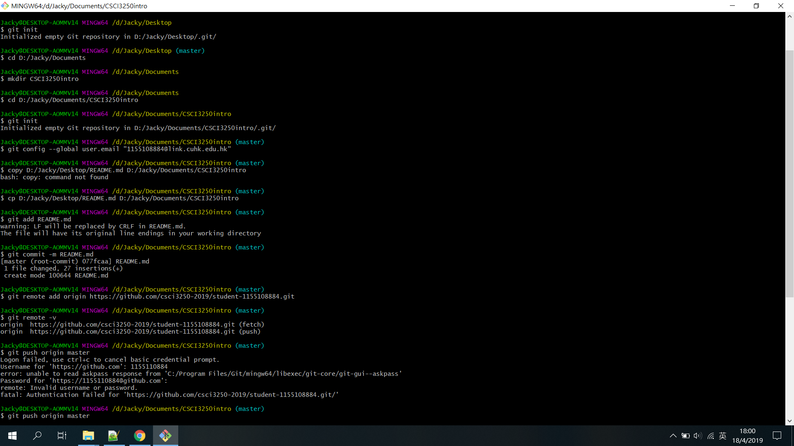

# sutdent-1155108884

`csci 3250 project milestone 2#`

## Welcome to my first repository

	I am **Jacky** from the major of Computer Science.
	I like *CSCI3250+3251*.
	It is the first time ti use GitHub.
	Here are somethings that I have done in GitHub:

- [x] Create an account (done!)
- [x] Try GitHub (done!)
- [x] On your computer, create a folder for a new git local repo (git init)
- [x] Create a new file readme.md using Markdown to include...
- [x] Add and commit this to your local repo
- [x] Create a new repo on our GitHub organisation: https://github.com/csci3250-2019
- [x] The new repo must have this name: student-1155xxxxxx where 1155xxxxxx should be your student ID
- [x] Push your local repo (which only includes readme.md) into this new GitHub repo

task|content
-|-
Milestone 1#|Sign up GitHub
Milestone 2#|First repository

Screenshot of Git commands:
